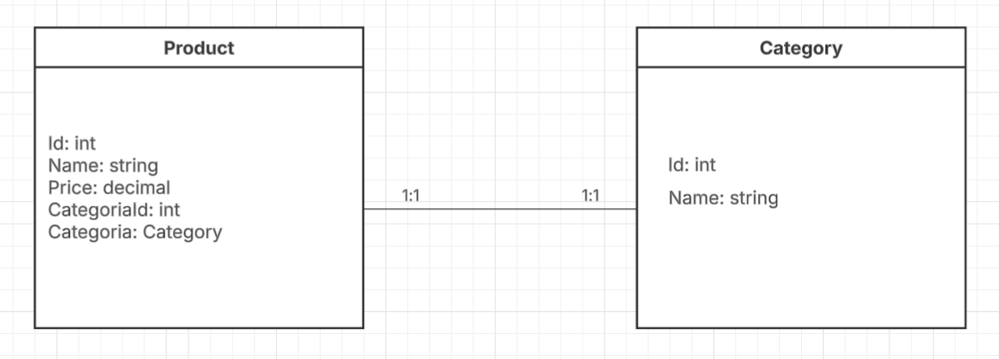

# StoreCatalogAPI

## Description

**StoreCatalogAPI** is a RESTful API built with **ASP.NET Core 7** and **Entity Framework Core**, designed to manage products and categories for a store.  
It implements a **full CRUD** for products and categories with asynchronous operations, following best development practices and a clean structure. It is ready to integrate with any frontend or client application.

This API allows you to:  

- Create, read, update, and delete products (`Product`) and categories (`Category`).  
- Associate products with categories (`Category`) through the foreign key (`CategoriaId`).  
- Query categories and their related products.  
- Scale efficiently using **asynchronous methods (`async/await`)**.

---

## Project Structure

📁 **StoreCatalogAPI/**

├── 📁 **Controllers/** – Contains CRUD controllers for Product and Category  
├── 📁 **Data/** – DbContext for EF Core configuration  
├── 📁 **Migrations/** – Migration history for database creation  
├── 📁 **Models/** – Product and Category entities  
├── 📄 **Program.cs** – Service and DI configuration  
├── 📄 **appsettings.json** – Connection string and configuration  

## Features

### Product
- `GET /api/Product` - Retrieves all products.
- `GET /api/Product/{id}` - Retrieves a specific product by ID.
- `POST /api/Product` - Creates a new product.
- `PUT /api/Product/{id}` - Updates an existing product.
- `DELETE /api/Product/{id}` - Deletes a product.

### Category
- `GET /api/Category` - Retrieves all categories.
- `GET /api/Category/{id}` - Retrieves a specific category by ID.
- `POST /api/Category` - Creates a new category.
- `PUT /api/Category/{id}` - Updates an existing category.
- `DELETE /api/Category/{id}` - Deletes a category.

All endpoints use **JSON** and return standard HTTP responses (`200 OK`, `201 Created`, `204 NoContent`, `400 BadRequest`, `404 NotFound`).

## Database Setup

1. Open `appsettings.json` and configure your **connection string**:

```json
{
  "ConnectionStrings": {
    "DefaultConnection": "Server=YOUR_SERVER;Database=StoreCatalogDb; User Id=YOUR_USER; Password=YOUR_PASSWORD;TrustServerCertificate=true;"
  }
}
```

## Database Setup

In `Program.cs`, the `DbContext` is already registered:

```csharp
builder.Services.AddDbContext<AppDbContext>(options =>
    options.UseSqlServer(builder.Configuration.GetConnectionString("DefaultConnection")));
```
If you need to use another database, replace UseSqlServer with another one.

## Create the database using migrations:

```bash
dotnet ef migrations add InitialCreate
dotnet ef database update
```

## Notes

- All database operations are **asynchronous** (`async/await`).
- The **Category → Product** relationship is implemented via `ICollection<Product>` in the category, enabling navigation.

## Class Diagram

 <!-- Replace this path with your diagram image -->
